# codex_server

Personal AI playground: FastAPI backend з Codex CLI app-server, Telegram bot
із markdown-рендером + voice↔voice, Connect-RPC API і web-chat на gRPC
server-streaming (HTTP/2) поверх Connect-RPC.

## Компоненти

1. **Codex backend** — FastAPI на free-threaded Python 3.14 (no-GIL).
   JSON-RPC 2.0 поверх WS до Codex CLI sidecar (port 4500). Connect-RPC API
   на `/api` для всього: `Auth`, `Health`, `User`, `Chat` (вкл. server-stream
   `RunTurn` + `InterruptTurn`/`SteerTurn` + `GetCodexUsage`), `Message`,
   `Event`, `Notes`, `Uploads`. MCP sub-app на `/mcp/streamable` з
   bearer-auth. **Native WebSocket на browser-edge'і вже нема** — Connect-RPC
   server-streaming через HTTP/2 flow-control window забезпечує backpressure
   натурально. WS лишається тільки до Codex CLI sidecar (їх wire-protocol).
2. **Telegram bot** — `aiogram` v3 polling всередині FastAPI lifespan.
   Доступний всім TG-юзерам; admin-роль (shell + file_change tools, `/restart`)
   видається через `TG_ADMIN_USER_IDS`. Markdown від Codex рендериться у
   TG-HTML (bold, italic, code, blockquote, lists, links, fences з
   syntax-highlight). Voice in → STT (Speechmatics) → Codex → TTS (Google
   Cloud) → `bot.send_voice`. Multi-bubble streaming з throttle, inline
   controls (Stop / Steer / New thread), native image generation через
   Codex CLI v2 `ThreadItem` + MCP `show_image` для re-delivery без regen.
3. **Web chat** — Svelte 5 (runes: `$state`/`$derived`/`$effect`) + Vite +
   Tailwind 4 + `@connectrpc/connect-web` + `@bufbuild/protobuf`. Streaming
   turns через `ChatService.runTurn` (server-stream), typewriter-render,
   interrupt/steer, voice in (TTS reply теж), image attach. Tool-calls (live
   і historical) — згорнутий «N completed» дропдаун (`CompletedTools.svelte`).
   Sentry frontend (`@sentry/svelte`) → self-hosted Bugsink. Live у
   `codex-web` Vite dev контейнері на `http://localhost:8088`.

## Архітектура

```
                     ┌────────────────┐
                     │   Telegram     │
                     │  (long-poll)   │
                     └────────┬───────┘
                              │ HTTPS
                              ▼
   ┌──────────┐ HTTP/2  ┌─────────────────────────────────┐  WS (JSON-RPC 2.0)  ┌───────────────┐
   │ Browser  │◄───────►│   codex-server (FastAPI 3.14t)  │◄───────────────────►│  codex-cli    │
   │ Svelte 5 │ Connect │  ┌─────────────────────────┐    │                     │  sidecar (admin)│
   │ ConnectRPC         │  │ /api  ConnectRouter     │    │  WS (separate)      ├───────────────┤
   └──────────┘         │  │  Auth/Health/User/Chat  │    │◄───────────────────►│  codex-cli    │
                        │  │  Message/Event/Notes/   │    │                     │  guest sidecar │
                        │  │  Uploads                │    │                     └───────────────┘
                        │  │ /mcp/streamable (bearer)│    │
                        │  │ TG aiogram polling      │    │  Redis pub/sub bus
                        │  └──────────┬──────────────┘    │  + turn_registry CAS
                        └─────┬───────┼────────┬──────────┘  (cross-worker steer/interrupt)
                              │       │        │
                              ▼       ▼        ▼
                       ┌──────────┐ ┌──────┐ ┌──────────────┐
                       │ Postgres │ │Redis │ │ S3 / MinIO   │
                       │  18      │ │ 8.6  │ │ (R2 у проді) │
                       └──────────┘ └──────┘ └──────────────┘

                       Observability:  Sentry SDK → Bugsink (self-hosted, :8089)
                       Auto-restart:   docker/watchdog (label codex.watchdog=true)
```

Backpressure: Codex WS notification queue (bounded per-sidecar:
`CODEX_NOTIFICATION_QUEUE_MAX_ADMIN=400`, `_GUEST=1000`, drop-oldest+WARN)
→ async generator `stream_turn` (з token-delta coalesce,
`CHAT_TOKEN_COALESCE_BYTES`) → Connect-RPC server stream → HTTP/2 flow-
control window. Slow client блокує `ASGI send` → блокує `yield` → upstream
queue заповнюється. Жодного зайвого буфера у stream loop.

## Сховища

- **Postgres 18** — `users` (з `role` enum + `password_hash`), `chats`,
  `messages`, `events`, `uploads` (з `user_id` FK), `notes` (full-text
  search через `tsvector` + GIN). Локально — у docker-compose. Cloud-prod
  (Neon) — backlog (TODO #3 у `estimates/INTEGRATION.md`).
- **Redis 8.6** — кілька різних callsite'ів:
  - **pub/sub bus** для ChatEvent fan-out (TG renderer + web stream + monitoring)
  - **polling-lock** для безпечного multi-instance restart'у TG бота
  - **turn_registry** — Redis CAS для cross-worker steer/interrupt
    (`gunicorn -w 2+`); тримає `{thread_id, turn_id | None}` живих турнів
  - **orphan-thread quarantine** (24h TTL) для broken Codex thread_id
  - **cache singleton** для transient state
- **S3-compatible object storage** для media (image_generation outputs, TG
  uploads, web uploads). Локально — MinIO. Cloud-prod (Cloudflare R2) —
  backlog: той самий `aiobotocore`-клієнт, міняється тільки endpoint.

### Схема таблиць

Усі таблиці наслідують `Base` → `id BIGINT PK autoincrement`, `created_at TIMESTAMPTZ`, `updated_at TIMESTAMPTZ` (для append-only `messages`/`events` `updated_at` просто не апдейтиться). Json-поля — `JSONB`. Postgres ENUM-типи (`user_role`, `chat_source`, `message_role`, `event_kind`) — single source of truth у `app/models/enums.py`.



> **`docs/schema.svg` потребує регенерації** — додались `notes.user_id`, нова таблиця `invites` (FK на users двічі: created_by + used_by). Актуальний source — `docs/schema.mmd`; відкрий у [mermaid.live](https://mermaid.live) → Export SVG → перезаписати `docs/schema.svg`.

**Як оновлювати картинку:**
- Джерело — `docs/schema.mmd` (Mermaid erDiagram) + `docs/schema.svg` (rendered)
- При зміні моделі: правиш `.mmd` → відкриваєш у [mermaid.live](https://mermaid.live) → Export SVG → перезаписуєш `docs/schema.svg`. Або: `npx -p @mermaid-js/mermaid-cli mmdc -i docs/schema.mmd -o docs/schema.svg` (тягне Chromium ~200MB).

**EventKind значення:** `THREAD_OPENED`, `THREAD_RESET`, `THREAD_LOST` (transport reconnect), `TURN_STARTED`, `TURN_COMPLETED`, `TURN_INTERRUPTED`, `TURN_FAILED`, `ATTACHMENT_RECEIVED`, `AUDIO_TRANSCRIBED`, `ERROR`.

**Alembic chain (поточний head — `d8e5f3a4b6c2`):**

```
4c560fef8dcd  init_schema
       ↓
8a3e1c5d4f02  add_user_role          (ENUM user_role + User.role)
       ↓
b1f2c3d4e5a6  add_user_password_hash (User.password_hash + display_name)
       ↓
c7d4e8a9b2f1  uploads_user_id        (Upload.user_id FK + index)
       ↓
d8e5f3a4b6c2  multi_user_web         (Note.user_id FK + invites table)   ← head
```

## Запуск

```bash
cp .env.example .env             # заповнити: TG_BOT_TOKEN, TG_ADMIN_USER_IDS,
                                 # REDIS_PASSWORD, SPEECHMATICS_API_KEY,
                                 # GOOGLE_TTS_API_KEY, MCP_CALLBACK_TOKEN,
                                 # SENTRY_DSN (опціонально), BUGSINK_AUTH_TOKEN
./docker/up.sh                   # бутстрап з усіма compose-файлами
```

Compose-файли розкидані по призначенню:

| Файл                              | Що піднімає                                                 |
|-----------------------------------|-------------------------------------------------------------|
| `docker/compose.yml`              | `codex-server` + `codex-web` (Vite dev) + postgres + redis + minio + minio-init |
| `docker/compose.codex.yml`        | `codex-cli` (admin sidecar) + `codex-cli-guest` (окремий проект `codex_codex`)  |
| `docker/compose.bugsink.yml`      | Self-hosted Sentry-compatible Bugsink на `:8089`            |
| `docker/compose.watch.yml`        | Watchdog контейнер — restart за `codex.watchdog=true` label |

`./docker/up.sh` піднімає все по черзі через спільну external network `codex_net`. `./docker/down.sh` валить усе.

Перед першим запуском гостьового sidecar — авторизуватись окремо (alt-ChatGPT
аккаунт, не admin):

```bash
docker compose -f docker/compose.codex.yml -p codex_codex run --rm codex-cli-guest codex login --device-auth
```

Без docker (тільки FastAPI, без Codex sidecar):

```bash
uv sync && uvicorn app.main:app --port 8088
```

Порти:
- `8088` — web UI (Vite dev → проксі на `codex-server:8000`)
- `5432`, `9000`/`9001` — postgres / minio API + console (debug only)
- `8089` — Bugsink UI
- `codex-server:8000` — internal, не виставлений назовні

## Telegram bot

1. Створити bot token через `@BotFather`.
2. Дізнатися Telegram user id (`@userinfobot`).
3. У `.env`:
   ```bash
   TG_BOT_TOKEN=...
   TG_ADMIN_USER_IDS=123456789,987654321   # comma-separated; promote → ADMIN
   ```

Юзери поза `TG_ADMIN_USER_IDS` отримують `UserRole.USER` і ходять у
**окремий гостьовий Codex-контейнер** (без host-repo mount, без
`docker.sock`, окремий ChatGPT login → ізольований token-budget). Admin
користується основним sidecar'ом з повним доступом.

Команди:
- `/new` — новий thread (скинути контекст моделі, лишити DB history)
- `/stop` — перервати поточну відповідь (`turn/interrupt`)
- `/reset` — закрити сесію + очистити stored thread_id
- `/restart` — ребут контейнера через Docker socket (admin-only)

Voice/audio транскрибуються Speechmatics (`SPEECHMATICS_API_KEY`). Текстову
відповідь Codex'а проганяємо через Google Cloud TTS (`GOOGLE_TTS_API_KEY`)
у OGG_OPUS і шлемо як `bot.send_voice`. Якщо `GOOGLE_TTS_API_KEY` порожній —
voice-input отримує текстову відповідь.

## Markdown у TG

Codex повертає markdown (`**bold**`, fences, lists, blockquote). Сервіс
`tg_markdown` (`app/tg/markdown.py`) рендерить у TG-HTML whitelisted-тегами:

| Markdown            | TG render                                  |
|---------------------|--------------------------------------------|
| `# Header`          | `<b>Header</b>`                            |
| `**bold**` `*it*`   | `<b>bold</b>` `<i>it</i>`                  |
| `` `code` ``        | `<code>code</code>` (моноширний)           |
| ` ```py x=1 ``` `   | `<pre><code class="language-py">x=1</code></pre>` |
| `- a` / `1. a`      | `• a` / `1. a` (з indent для nested)       |
| `> quote`           | `<blockquote>quote</blockquote>`           |
| `[txt](url)`        | `<a href="url">txt</a>` (клікабельне)      |
| `~~strike~~`        | `<s>strike</s>`                            |
| `<table>`, `<h1>`...| дроп (інакше TG → 400)                     |

Chunks ≤4096 з balanced `<pre>` (cut усередині fence додає `</code></pre>` +
`<pre><code>` у наступному). Voice mode шле через `tg_markdown.to_plain` —
Google озвучує без зірочок/backtick'ів.

## Workflow

- **Codex CLI persona** живе у `AGENTS.md` — auto-load'иться сидеком на
  кожному турні. Контракт там: edit'и файлів — спитати "ок"; shell/git —
  робити одразу; image_generation → save у `~/.codex/generated_images/`,
  caption мовою юзера, не дублювати internal prompt-поля у відповіді.
- **Гостьовий персонаж** — `docker/codex/AGENTS-guest.md` (mounted у гостьовий
  контейнер як `/home/codex/workspace/AGENTS.md:ro`); мінімальна persona без
  repo/git/code-style.
- **Міграції:** `alembic upgrade head` (auto'ом на entrypoint'і, з
  `timeout 30` щоб asyncpg-teardown не вішав boot). Head: `d8e5f3a4b6c2`
  (`multi_user_web` — notes.user_id + invites одною міграцією).
- **Web auth (multi-user):** реєстрація email+password через
  `AuthService.Register(invite_token=...)`. Admin (визначається env
  `ADMIN_EMAIL`) при signup'і автоматично отримує `role=ADMIN` і обходить
  invite-перевірку — upsert на існуючий запис якщо він уже у БД. Решта
  юзерів — тільки за invite-токеном, який admin генерує через
  `AdminService.CreateInvite()` → `https://.../signup?invite=XYZ`. Endpoints
  під `/api/codex.v1.AdminService/*` захищені `require_admin`.
- **Rate-limit (RunTurn):** sliding-window у Redis, per-user. admin: none,
  web USER: 2 active / 30 per hour, TG guest: 1 active / 10 per hour. Reject
  з `ChatEvent.error{code='rate_limited'}` для web, текстова відповідь для TG.
- **Self-restart:** `/restart` у боті → `DockerControlService.restart_container`
  через `/var/run/docker.sock` (без `docker` CLI в образі). Admin-only.
- **Тести:** `uv run --group test pytest -q` (~88 у 13 файлах).
- **Web turn-registry у Redis** — `turn_registry.py` тримає `{thread_id, turn_id | None}` живих турнів. `register_pending` пише запис з `turn_id=None` до `turn/start`; `promote` дописує turn_id після. Interrupt RPC у race-window бачить pending → `drop` → worker'у-власнику `promote()` returns False → cancel turn. Cross-worker через one-shot WS. `GUNICORN_WORKERS=2+` works.
- **TZ logs** — `utc=False` у `log_config`; timestamps з offset (`+03:00`). Якщо ship'ити логи у aggregator що очікує Z-suffix — перевір парсер.
- **Bugsink порт `:8089`** має власний BUGSINK_AUTH_TOKEN на UI + DSN-auth на ingest. Не виставляти прямо на public-net без nginx + rate-limiting; tailnet/VPN OK для соло.
- **Lint/types:** `uv run --group lint ruff check app/ tests/` + `pyright app/`.
- **Pre-commit hooks:** `uv sync --group lint && uv run pre-commit install` (одноразово). Далі кожен `git commit` ганяє `ruff check --fix`, `ruff format`, `pyright app/`, `pytest -q`. Bypass — `git commit --no-verify` (тільки exceptional).
- **Гарячий редеплой коду:** edit → save → `docker exec codex-server gunicornc -c reload`
  (workspace mount = source of truth, alembic зробить pending міграції).

## Структура

```
codex_server/
├── app/
│   ├── main.py                 FastAPI() + Sentry init + lifespan
│   │                           (TG polling, Codex sidecar warm-up,
│   │                            interrupt_active_turns при shutdown)
│   ├── config.py               pydantic-settings
│   ├── healthcheck.py          standalone HC для docker (без TCP probe)
│   ├── log_config.py           structlog + uvicorn JSON formatters
│   ├── api/                    HTTP endpoints
│   │   ├── health.py           GET /health (для docker healthcheck)
│   │   ├── tg_webhook.py       (опціональний webhook вхід; default polling)
│   │   └── docs/               OpenAPI helper docs
│   ├── mcp/                    MCP sub-app (/mcp/streamable, bearer auth)
│   │   ├── core.py             FastAPI sub-app + auth middleware
│   │   ├── errors.py
│   │   └── tools/              show_image (re-deliver image without regen)
│   ├── rpc/                    Connect-RPC handlers
│   │   ├── auth.py             Login + Register (invite + ADMIN_EMAIL bypass) + Refresh
│   │   ├── admin.py            AdminService — CreateInvite/ListInvites/RevokeInvite/
│   │   │                       CreateUser/ListUsers (require_admin)
│   │   ├── health.py, user.py, message.py, event.py
│   │   ├── notes.py, uploads.py
│   │   ├── chat/               package — split kitchen-sink:
│   │   │   ├── service.py      ChatRPC (thin handlers: list/get/rename/delete,
│   │   │   │                   run_turn (rate-limit gated), interrupt_turn,
│   │   │   │                   steer_turn, get_usage)
│   │   │   ├── stream.py       codex events → pb pipeline + token-delta coalesce
│   │   │   │                   (idle, errors, persist)
│   │   │   ├── mappers.py      ChatEvent ↔ pb + redaction + usage
│   │   │   ├── uploads.py      resolve upload_ids → codex-input
│   │   │   ├── tts.py          async post-turn TTS attach (voice in → voice out)
│   │   │   └── guards.py       pagination + ownership check
│   │   ├── _auth.py            JWT verify dep (require_user, require_admin)
│   │   ├── _mappers.py         ORM ↔ pb conversions (single source of truth)
│   │   └── router.py           ConnectRouter ASGI mount
│   ├── tg/                     aiogram polling
│   │   ├── service.py          bot lifecycle
│   │   ├── handlers.py         /new /stop /reset /restart + callbacks
│   │   ├── sessions.py         per-chat CodexClient store + admin/guest routing
│   │   ├── turn/               package — split kitchen-sink:
│   │   │   ├── runner.py       TurnRunner (orchestration entry)
│   │   │   ├── stream.py       codex event loop
│   │   │   ├── outcomes.py     handle_done / empty / dropped + send_response
│   │   │   ├── persistence.py  user/assistant message + journal
│   │   │   └── control.py      cancel / auto-reset / steer / emit_failure
│   │   ├── progress.py         status bubble + multi-bubble streaming
│   │   ├── output.py           send_text / send_voice_reply / send_attachment
│   │   ├── media.py            STT + attachment pipeline для inbound
│   │   └── markdown.py         TelegramMarkdown (singleton tg_markdown)
│   ├── models/                 SQLAlchemy ORM (User з UserRole+password_hash,
│   │                           Chat, Message, Event, Upload з user_id FK,
│   │                           Note з user_id FK, Invite (single-use signup);
│   │                           StrEnum kinds)
│   ├── services/               <resource>/{service.py, default.py, __init__.py}
│   │   ├── auth/               JWT issue/verify + password hashing (argon2)
│   │   ├── codex/              Codex CLI app-server клієнт:
│   │   │   ├── transport.py    JSON-RPC over WS + bounded notification queue
│   │   │   │                   (200, drop+warn) + handler hook
│   │   │   ├── routing.py      TurnRouter — per-turn-id fan-out (фіксить
│   │   │   │                   leak'и нот з минулого турну в наступний)
│   │   │   ├── client.py       CodexClient (handshake, threads, run_turn)
│   │   │   ├── runner.py       open_codex_turn — RPC-side турн entry
│   │   │   ├── turn_registry.py  Redis CAS lifecycle (register_pending /
│   │   │   │                   promote / drop) для cross-worker
│   │   │   │                   steer/interrupt у `gunicorn -w 2+`
│   │   │   ├── error_codes.py  CodexErrorCode enum (TURN_TIMEOUT, STREAM_DROPPED,
│   │   │   │                   CODEX_ERROR, тощо)
│   │   │   ├── collector.py    StreamCollector — shared state mutator
│   │   │   │                   (web/tg pipelines не дублюють absorb-logic)
│   │   │   ├── events/         types.py + translate.py + idle.py
│   │   │   └── history.py
│   │   ├── sessions/           Generic ChatSessionStore (TG/web — subclass'и)
│   │   ├── codex_usage/        account/rateLimits/read обгортка
│   │   ├── errors/             Sentry scrub_event + error classifier
│   │   ├── invites/            Single-use signup invite tokens (create/redeem)
│   │   ├── rate_limit/         Per-user RunTurn quota (active + sliding window)
│   │   ├── chats/, users/, messages/, events/, uploads/, notes/
│   │   ├── bus/                Redis pub/sub fan-out
│   │   ├── cache/              Redis client singleton
│   │   ├── storage/            S3/MinIO via aiobotocore
│   │   ├── stt/                Speechmatics batch v2
│   │   ├── tts/                Google Cloud TTS (REST v1, OGG_OPUS)
│   │   └── docker/             host docker daemon control (/restart)
│   ├── utils/paths.py          trusted-root resolver для tool-supplied paths
│   ├── deps/                   FastAPI auth dep
│   └── grpc_generated/         Connect stubs (gitignored regen via scripts/gen-proto.sh)
├── web/                        Svelte 5 + Vite + Tailwind 4
│   ├── src/
│   │   ├── App.svelte
│   │   ├── main.ts
│   │   ├── features/
│   │   │   ├── auth/           Login.svelte + Signup.svelte + auth.ts (HttpOnly cookie)
│   │   │   ├── chat/           Chat / ChatList / MessageList / Message /
│   │   │   │                   Composer / Attachment / ToolCall /
│   │   │   │                   CompletedTools / Usage / typewriter /
│   │   │   │                   turnSignal / markdown
│   │   │   └── notes/          Notes.svelte
│   │   ├── shared/
│   │   │   ├── components/     Spinner
│   │   │   └── lib/            transport / clients / theme / time / token
│   │   └── gen/codex/v1/       *_pb.ts (regen `npm run gen` через buf)
│   ├── buf.gen.yaml            protoc-gen-es → src/gen
│   ├── package.json            scripts: gen / dev / build / check
│   └── vite.config.ts          /api proxy → codex-server:8000
├── protos/codex/v1/            *.proto (auth, chat, common, event, message,
│                               user, notes, uploads) — single source of truth
│                               для server stubs + client stubs
├── migrations/versions/        alembic chain:
│                                 4c560fef8dcd → 8a3e1c5d4f02 →
│                                 b1f2c3d4e5a6 → c7d4e8a9b2f1 →
│                                 d8e5f3a4b6c2 (head)
├── tests/                      pytest (~88 tests у 13 файлах):
│                               auth_rpc/service, chat_rpc, codex_collector,
│                               codex_runner, codex_streaming, codex_translate,
│                               messages_service, tg_markdown/progress/turn,
│                               turn_registry, user_service
├── docker/
│   ├── codex/                  Dockerfile + entrypoint + AGENTS-guest.md
│   ├── server/                 Dockerfile (multi-stage, free-threaded 3.14t)
│   │                           + entrypoint.sh (alembic upgrade head + start)
│   ├── web/                    ← порожній; production single-image build TODO
│   ├── watchdog/watch.sh       docker events → restart по label
│   ├── compose.yml             app stack (codex-server + codex-web + pg/redis/minio)
│   ├── compose.codex.yml       Codex CLI sidecars (admin + guest)
│   ├── compose.bugsink.yml     self-hosted Sentry-compatible (порт :8089)
│   ├── compose.watch.yml       watchdog контейнер
│   ├── up.sh / down.sh         оркестрація всіх compose-файлів
├── estimates/                  (gitignored — особисті планувальні нотатки)
│   └── INTEGRATION.md          phase-by-phase status + TODO
├── docs/
│   ├── schema.svg              ER diagram (картинка для README, hand-written)
│   └── schema.mmd              Mermaid source (правити тут → regen .svg)
├── scripts/gen-proto.sh        Python pb2 + connect stubs
├── gunicorn.conf.py            workers, reload, signal handling
├── pyproject.toml              Python 3.14 + deps (uv-managed)
├── alembic.ini
├── AGENTS.md                   Codex CLI persona contract (admin)
└── README.md                   ← цей файл
```
